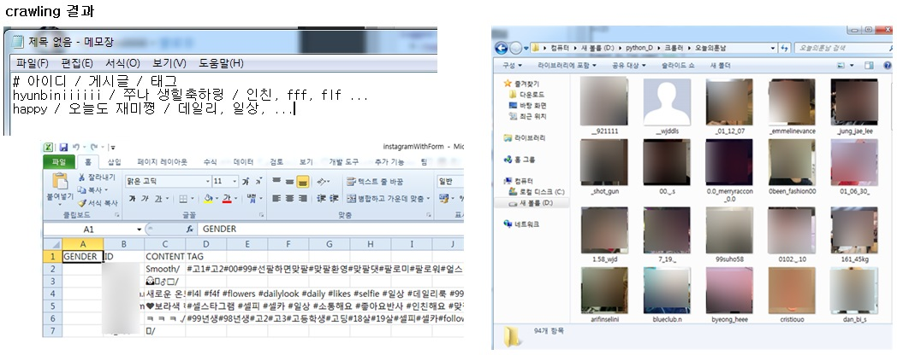
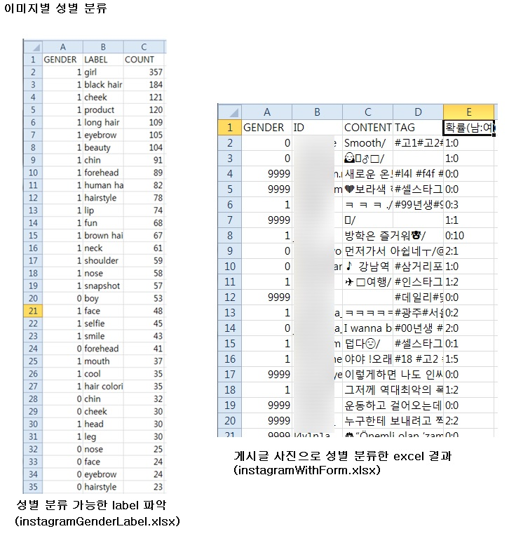
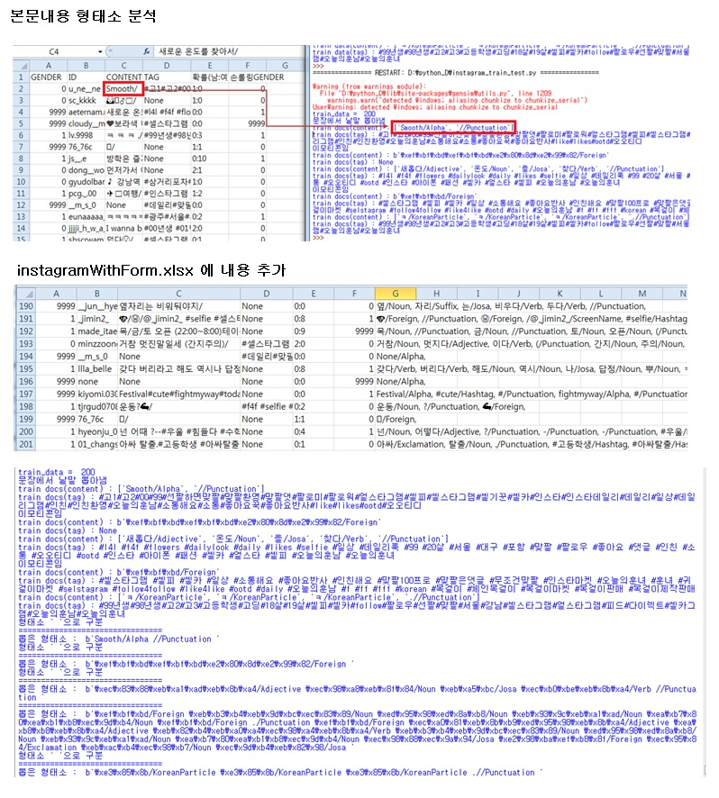

# InstagramAnalysis2018

# 기간
    1개월 (2018-07-28 ~ 2018-09-09)
    
    
    
# 개요
    많이 사용하는 단어에 따른 성별 분류가 가능한 지에 대해 알아보기 위해 
    인스타그램의 게시글을 분석하는 프로젝트를 진행했습니다.
    (미완)
    
    
# 사용한 라이브러리 및 구현 환경
    1. 구현 환경
        - Window 7
        - Python
        
    2. 사용한 라이브러리 및 기능
        - Google Vision API를 사용해 인물, 성별 탐지
        - KoNLP를 사용한 형태소 분석
        - openpyxl을 사용한 분석한 데이터 자동 문서화

# 필요 기능과 과정
    * 글에 대한 <본문 내용>과 그 글을 올린 사람의 <성별>에 대한 정보가 필요합니다.
    * <본문 내용>은 크롤링을 통해 수집할 수 있었으나, 
      <성별>은 인스타그램에서 정보를 공개하지 않기에 Google Vision API를 통해 분류했습니다.
      
    1. 게시글 이미지, 댓글, 본문 크롤링 기능
        - 오늘의 훈남, 얼스타그램, 셀스타그램, 예비군, 일상 등 자신에 대한 
          글을 많이 올렸을 법한 태그를 기준으로 검색해 크롤링합니다.
        - 크롤링한 정보를 openpyxl을 통해 자동으로 엑셀에 저장합니다.
    2. 이미지로 성별 분류하는 기능
        - id에 따른 성별 정보가 필요한데, 인스타그램 자체에 성별에 대한 정보가 없어 프로필 이미지
          , 그 사람의 게시글 이미지를 Google Vision API를 사용해 나온 label 값으로 성별을 분류했습니다.
          (girl, beauty, long hair, woman) / (boy, military, suit, man, male)
    3. 형태소 분석 기능
        - KoNLP, Gensim doc2vec을 사용해 본문과 댓글의 형태소를 분석했습니다.

# 주요 기능별 소스코드 설명
## 1. 게시글 이미지, 댓글, 본문 
    *** 아래의 두 개 방법 중 [크롤링 한 결과를 excel에 저장]하는 코드만 실행하시면 됩니다. ***
    1. 크롤링 한 결과를 txt에 저장
        (1) instagram_crawling_1-1(txt_version).py : 인스타그램 게시글의 아이디, 태그, 본문 저장하기
            1) input : 없음
            2) output
                - instagrampost.txt : 코드 실행 후 검색된 게시글 전체의 url 저장.
                - instagram.txt : 코드 실행 후 [ 아이디 / 게시글 / 태그 ]를 저장.
        (2) instagram_crawling_1-2(txt_version).py : 인스타그램 아이디에 따른 프로필 이미지 다운받기
            1) input
                - instagrampost.txt 필요 => 1번 파일을 실행 후 저장된 것.
            2) output
                - [크롤러] 폴더의 [오늘의훈남] 폴더 : 코드 실행 후 각 아이디의 프로필 사진 저장.
        
    2. 크롤링 한 결과를 excel에 저장
        (1) instagram_crawling_2-1(excel_version).py : 인스타그램 게시글의 아이디, 태그, 본문 저장하기
            1) input : 없음
            2) output
                - instagrampost2.txt : 코드 실행 후 검색된 게시글 전체의 url 저장
                - instagramWithForm.xlsx : 코드 실행 후 [ 성별 / 아이디 / 게시글 / 태그] 저장
                    => [성별]은 아직 알 수 없는 상태.(빈공간일 것)
        (2) instagram_crawling_2-2(excel_version).py : 인스타그램 아이디에 따른 프로필 이미지 다운받기
            1) input
                - instagramWithForm.xlsx 필요 => 1번 파일을 실행 후 저장된 것.
            2) output
                - [크롤러] 폴더의 [오늘의훈남] 폴더 : 코드 실행 후 각 아이디의 프로필 사진 저장.
   

## 2. 이미지로 성별 분류하는 기능
    *** Google Vision API를 사용해 프로필 사진으로 성별을 분류합니다. ***
    *** 아래의 방법 중 [instagram_crawling_10post.py], [gender_classification_3.py] 코드만 실행하시면 됩니다. ***
    1. gender_classification_1.py
        (1) 소스코드 설명
            * 프로필 사진을 Google Vision API를 사용해 분석했을 때 나오는 레이블 값에 따라 성별을 분류합니다.
                - ["girl", "beauty"]라는 단어가 나올 경우 [여성(1)]
                - ["boy"]라는 단어가 나올 경우 [남성(0)]
                - 안나올 경우 [모름(9999)]
                
        (2) input/output 파일
            * 같은 파일로 저장하므로 파일에 대한 백업이 필요합니다.
            1) input
                - instagramWithForm.xlsx 필요 => 크롤링 후 저장된 것.
            2) output
                - instagramWithForm.xlsx 에 추가적인 내용까지 저장
                
        (3) 결과
            * 200개 중에 43개만 구분할 수 있었음.
                - 프로필 사진이 사람이 아닐 경우도 있어서
                - 사람이지만 성별을 모를 수 있어서
                => 해결 필요
              
              
    2. gender_classification_2.py
        (1) 소스코드 설명
            * 200개 중에 43개만 구분한 위의(gender_classification_1.py) 문제점을 해결하기 위해
                - 프로필 사진 하나만이 아닌 각자 게시물 10개 사진을 가져와 그 사진으로 성별 분류
                    
        (2) instagram_crawling_10post.py
            * 위에서 크롤링한 것에 추가로 게시물 10개 사진 크롤링 하는 파일 필요
            1) input
                - instagramWithForm.xlsx 필요 => 크롤링 후 저장된 것.
            2) putput
                - [크롤러] 폴더의 [오늘의훈남2] 폴더 : 코드 실행 후 각 아이디의 게시글 사진 10개 저장.
            
        (3) input/output 파일
            * 같은 파일로 저장하므로 파일에 대한 백업이 필요합니다.
            1) input
                - instagramWithForm.xlsx 필요 => 크롤링 후 저장된 것.
                - [크롤러] 폴더의 [오늘의훈남2] 폴더 필요 => 각 아이디당 게시글 10개대한 사진 저장된 폴더
            2) output
                - instagramWithForm.xlsx에 추가적인 내용까지 저장
                
        (4) 결과
            * 200개 중에 125개만 구분할 수 있었음.
                => 해결 필요

    3. gender_label_find.py
        (1) 소스코드 설명
            * 200개 중에 125개만 구분한 위의 문제점을 해결하기 위해
                - label 더 추가해 분류하기 => 어떤 label값을 할지 먼저 파악해야 함.
                - [girl, beauty], [boy] 와 함께 나온 label이 무엇인지 파악해 성별분류 가능한 label값 찾아내기
                
        (2) input/output 파일
            * 같은 파일로 저장하므로 파일에 대한 백업이 필요합니다.
            1) input
                - instagramWithForm.xlsx 필요 => 크롤링 후 저장된 것.
                - [크롤러] 폴더의 [오늘의훈남2] 폴더 필요 => 각 아이디당 게시글 10개대한 사진 저장된 폴더
            2) output
                - instagramGenderLabel.xlsx에 성별별로 label 저장
                
                
    4. gender_classification_3.py
        (1) 소스코드 설명
            * 위의 gender_label_find.py를 통해 찾아낸 성별분류 가능한 label값으로 다시 분류
                - girl, boy 말고 다른 label로 분류하기(10개중에 여성:5, 남성:3, 모름:2 => 여성)
                - ["girl", "beauty", "long hair", "woman"]라는 단어가 나올 경우 [여성(1)]
                - ["boy", "military", "suit", "man", "male"]라는 단어가 나올 경우 [남성(0)]
                - 안나올 경우 [모름(9999)]
                
        (2) input/output 파일
            * 같은 파일로 저장하므로 파일에 대한 백업이 필요합니다.
            1) input
                - instagramWithForm.xlsx 필요 => 크롤링 후 저장된 것.
                - [크롤러] 폴더의 [오늘의훈남2] 폴더 필요 => 각 아이디당 게시글 10개대한 사진 저장된 폴더
            2) output
                - instagramWithForm.xlsx에 추가적인 내용까지 저장
                
        (3) 결과
            * 200개 중에 134개만 구분할 수 있었음. => 스스로 검증하는 작업 필요!
         

## 3. 형태소 분석 기능
    *** KoNLP, Gensim doc2vec을 사용해 형태소를 분석합니다. ***
    1. content_analysis_with_konlp.py
        (1) 소스코드 설명
            * KoNLP를 사용해 문장을 분류합니다.
            * 크롤링한 본문의 내용 형태소를 분류합니다.
            
        (2) input/output 파일
            * 같은 파일로 저장하므로 파일에 대한 백업이 필요합니다.
            1) input
                - instagramWithForm.xlsx 필요 => 크롤링 후 저장된 것.
            2) output
                - instagramWithForm.xlsx에 추가적인 내용까지 저장

